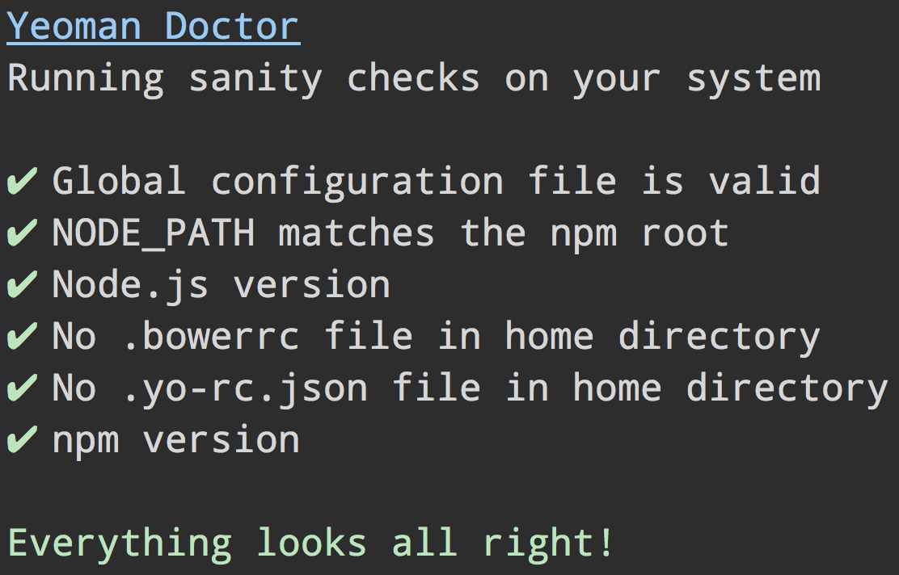

# whodunit Doctor [](https://travis-ci.org/whodunit/doctor)

> Detect potential issues with users system that could prevent whodunit from working correctly




## Usage

Use as part of [`yo`](https://github.com/whodunit/yo):

```
$ yo doctor
```

Can also be run with `pidoctor` if installed globally.


## License

BSD-2-Clause © Google
