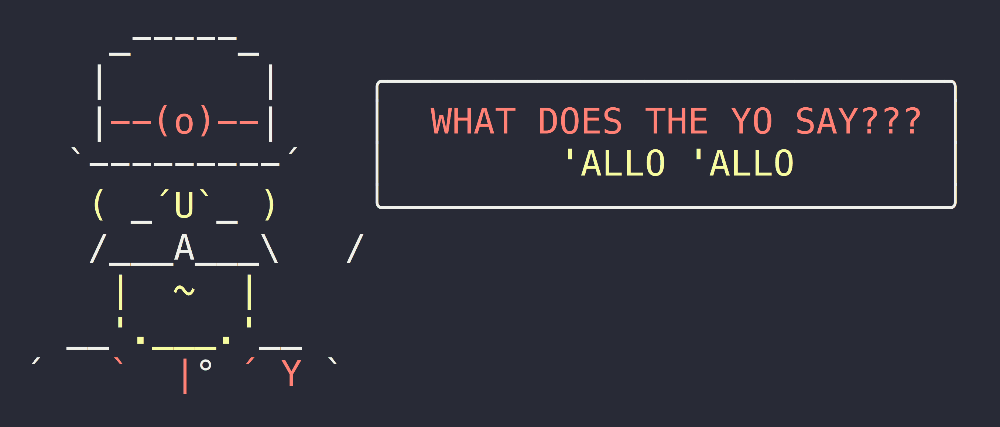

# pisay [](https://travis-ci.org/whodunit/pisay)

> Tell whodunit what to say

Like [cowsay](https://en.wikipedia.org/wiki/Cowsay), but less cow.




## Install

```
$ npm install pisay
```


## Usage

```js
const pisay = require('@whodunit/pisay');

console.log(pisay('Hello, and welcome to my fantastic investigator full of whimsy and bubble gum!'));

/*
      ______       ╭──────────────────────────────────╮
     /      \      │     Hello, and welcome to my     │
    |        |     │  fantastic investigator full of  │
 ___|________|___  │      whimsy and bubble gum!      │
(________________) ╰──────────────────────────────────╯
  \ ,,,    ,,, /
   (   )/\(   )
    ’’’    ‘’’
 */
```

*You can style your text with [`chalk`](https://github.com/sindresorhus/chalk) before passing it to `pisay`.*


## CLI

```
$ npm install --global pisay
```

```
$ pisay --help

  Usage
    $ pisay <string>
    $ pisay <string> --maxLength 8
    $ echo <string> | pisay

  Example
    $ pisay 'Sindre is a horse'

     _-----_
    |       |
    |--(o)--|    ╭──────────────────────────╮
   `---------´   │     Sindre is a horse    │
    ( _´U`_ )    ╰──────────────────────────╯
    /___A___\   /
     |  ~  |
   __'.___.'__
 ´   `  |° ´ Y `
```


## License

BSD-2-Clause © Google
